# Motorcycle Selling Application (Window Form Java)
## Team Members
```bash
ID          | Full Name
3120410278    Nguyen Thanh Quynh Linh
```
## Project Description:
The construction of motorbike management application is an important job, factories, businesses or small business shops need sales management activities if they want to operate effectively. To manage an effective sales, manual implementation becomes complicated, time -consuming, and many employees.
Therefore, it is necessary to apply information technology to perform the job easier, businesses can grasp the information about goods, supplies, products or customers more clearly, quickly and promptly.
## Tech Stack Used:
```bash
Language:
	* Java
Database:
    * MySql
```
## Functions in the application:
* Sales: Employees can choose products in a table at the request of customers, the selected products will be added to the cart. When paying employees, the customer needs to confirm the customer information will then print the invoice and complete the sales
* Import: When the imported staff of products imported will wait after determining the number of products to be imported and the supplier of the product. The products will be delivered to the warehouse
* Staff manager: Administrator can view all information related to the store staff. Can add new staff, repair, delete
* Customer management: The administrator can view all contact information
Overlooking customers who have bought products. Can add new customers, repair, delete
* Product management: Employees can number of products in the warehouse,
Add to remove products (can import/export data from Excel file)
* Product portfolio management: Employees can view categories that can add, edit, delete categories
* Supplier manager: Employees can see if the suppliers are available or can add, edit, delete the categories
* List of import invoices: Employees can review the import invoices
* List of export invoices: Employees can review sales invoices

## Steps to run the application:
```
1. Clone from github
2. Start running the application and move to the folder configuration src -> DAO -> ConnectUnit.java, change your name according to your MySQL
3. Add database_jav.sql (Assests-> Database) in the database folder to MySQL
4. Then start the application
```
## [Project Demo Link](https://www.youtube.com/watch?v=fe7uRrCEjwE)
## Some features of the site:
Login                    |                   Home
:---------------------------------:        |      :------------------------------:
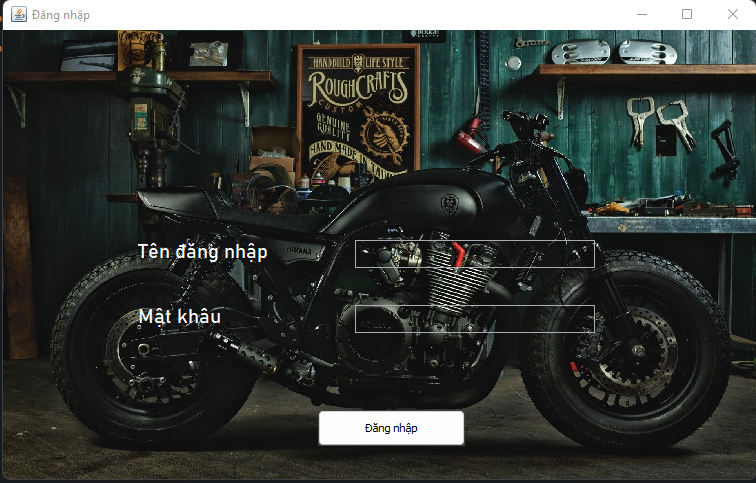  | 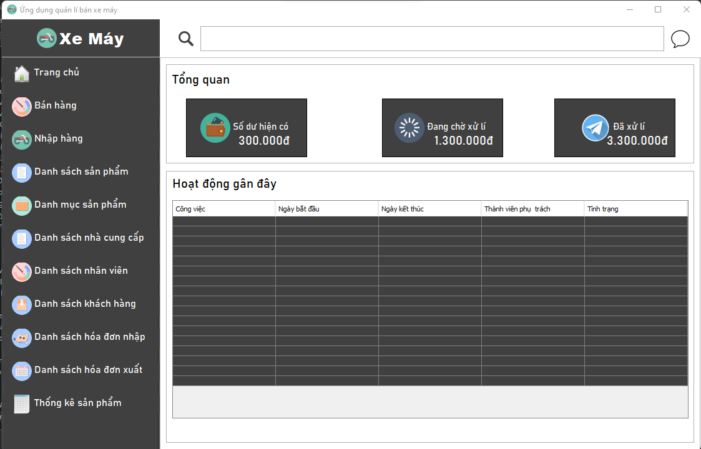

Sales                   |                   Import Product
:---------------------------------:        |      :------------------------------:
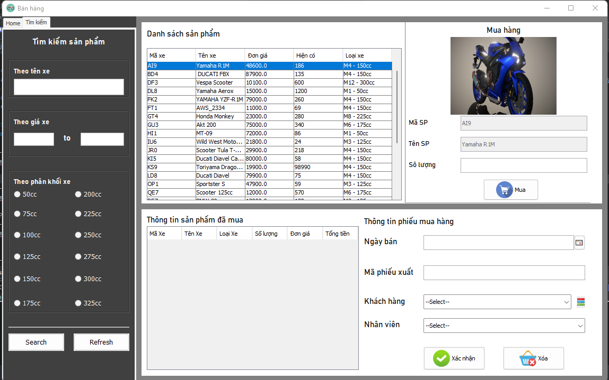  | 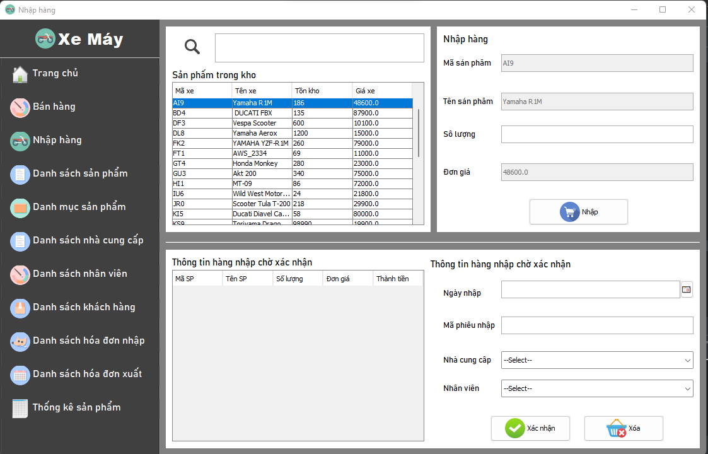

Product                   |                   Category
:---------------------------------:        |      :------------------------------:
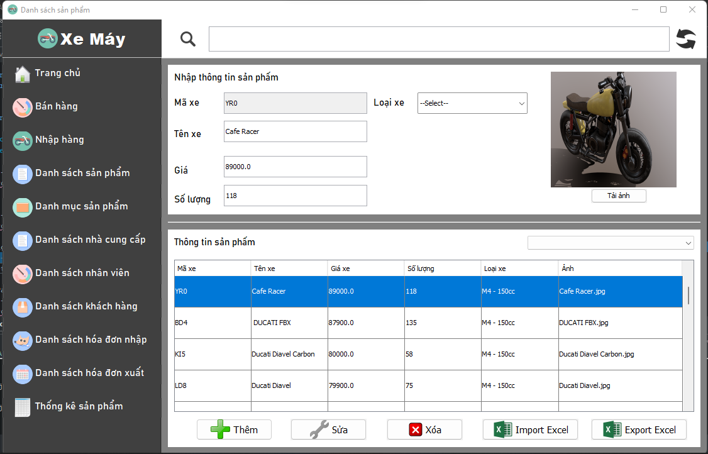  | 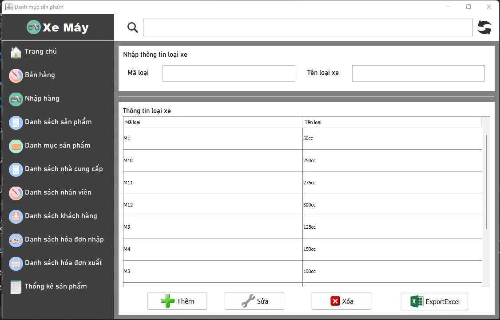

Brand                   |                   Staff
:---------------------------------:        |      :------------------------------:
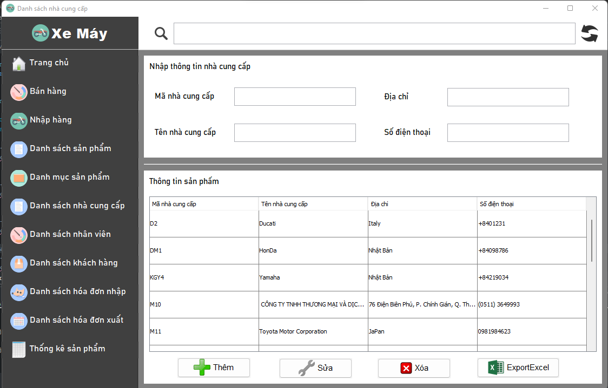  | 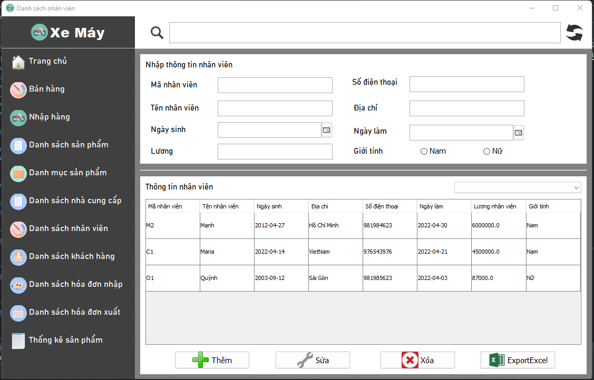
Customer                   |                   Statistical
:---------------------------------:        |      :------------------------------:
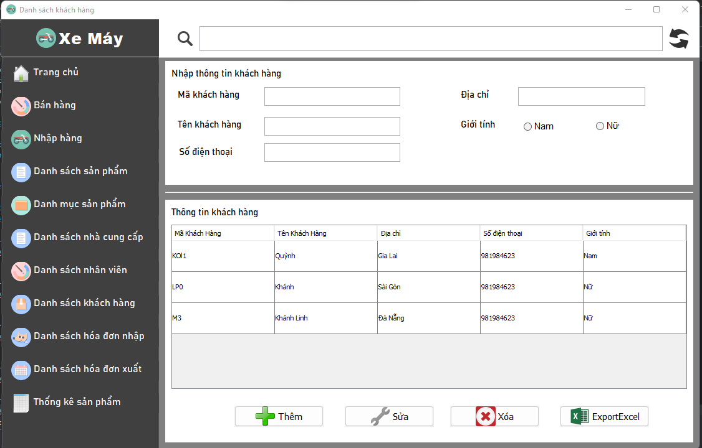  | 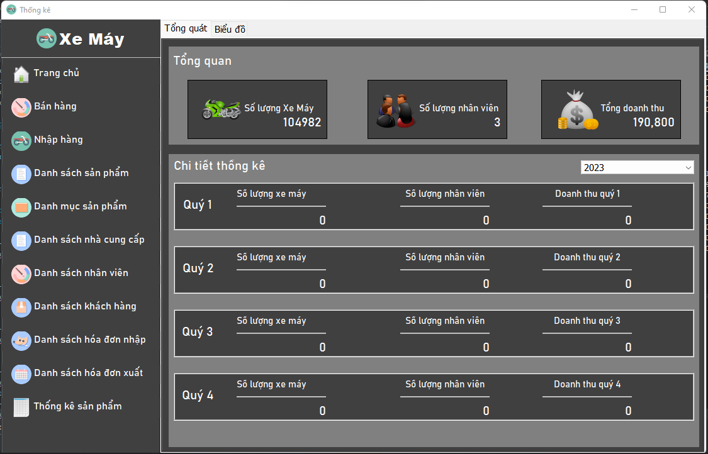

Chart                   |
:---------------------------------:        |
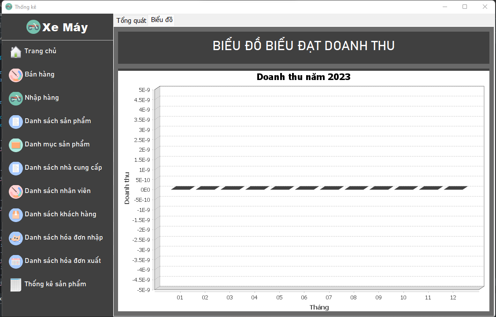  |
